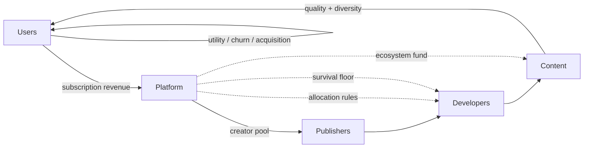
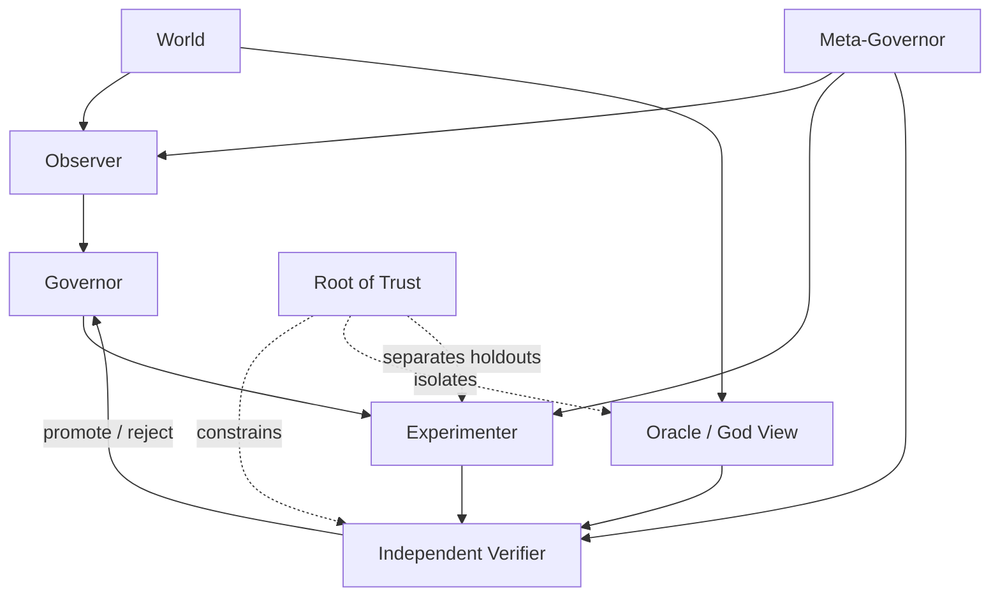

<p align="center">
  
</p>

<p align="center">
  <a href="https://github.com/hopeless-t/market-microcosm-lab/actions/workflows/ci.yml"></a>
  <a href="https://hopeless-t.github.io/market-microcosm-lab/"></a>
  
  
  
  
</p>

<p align="center">
  <strong>A self-improving research laboratory for sustainable market ecosystems.</strong><br>
  Users, developers, publishers, content, and platforms are treated as a living economic microcosm whose long-run viability must survive shocks, strategic adaptation, and imperfect observation.
</p>

<p align="center">
  <a href="https://hopeless-t.github.io/market-microcosm-lab/"><strong>Research site</strong></a>
  ·
  <a href="RESULTS.md"><strong>Current results</strong></a>
  ·
  <a href="NORTH_STAR.md"><strong>North Star</strong></a>
  ·
  <a href="ROADMAP.md"><strong>Roadmap</strong></a>
  ·
  <a href="CONTRIBUTING.md"><strong>Contributing</strong></a>
</p>

> [!IMPORTANT]
> **Synthetic evidence only.** Current experiments are structural research worlds, not empirical estimates or policy recommendations for Netflix, Game Pass, SARTRAS, Spotify, or any named service.

## North Star

> **Discover allocation and governance rules that keep the whole ecosystem inside a robust viability region for as long as possible, under uncertainty, shocks, strategic adaptation, and imperfect observation.**

The target is not maximum one-period profit, watch time, play time, or another single proxy. The target is a market that remains worth participating in for all essential layers.

## Research dashboard

| Experiment | Question | Current signal |
| --- | --- | --- |
| **E000 · Exact World** | Can the laboratory verify itself against a fully enumerable universe? | Exact robust viability kernel + closed inner/meta loops |
| **E010 · Ecological Market** | What happens when revenue, creators, publishers, content, utility, churn, entry, and exit circulate? | Neutral survival saturated at 1.0 across all six initial mechanisms |
| **E011 · Pressure Knee** | Where does each mechanism actually break? | balanced/platform-heavy knee at 4; four other mechanisms at 3 |
| **E012 · Evaluator Meta-Loop** | Can the lab improve how it chooses mechanisms? | mild-curriculum generalized best on isolated outer stress holdout |
| **E013 · Pressure Decomposition** | Which E011 pressure component actually causes each collapse? | single-axis knees are 6–10+, much later than composite knees 3–4 |
| **E014 · Interaction Surfaces** | Can two moderate stresses cross the boundary when either alone survives? | 155 interaction-only cells across the three pairwise surfaces |
| **E015 · Adaptive Sampling** | Can the lab recover E014 with fewer expensive evaluations? | 882 → 205 queries (-76.8%) with exact recovery |
| **E016 · Adaptive Guard** | What happens when the adaptive sampler's assumptions stop being true? | generation mismatch and non-monotone audit both fail closed to exhaustive |

See **[RESULTS.md](RESULTS.md)** for model-relative results, collapse modes, and the current theory update.

## The ecosystem



The world closes the economic cycle:

```text
users
  → subscription revenue
  → platform / creator pool
  → publishers + developers
  → content availability
  → user utility
  → churn / acquisition
  → next-period users
```

Cash buffers, operating costs, actor exit, bounded entry, content disappearance, and explicit external sources/sinks are all represented.

## The self-improving laboratory

The repository contains **two coupled closed loops**.



### L1 — ecosystem self-improvement

Observe → generate challengers → shadow simulation → untouched promotion holdout → independent verification → promote/reject → repeat.

### L2 — meta self-improvement

Alternative observers, search widths, stress curricula, horizons, and evaluation budgets run complete L1 instances. Their resulting policies compete on a **third isolated meta-holdout**.

The optimizer does not certify itself.

## Why the Oracle is not the Governor

The simulator can expose complete latent state, but a deployable policy should not receive hidden truth just because the research harness has it.

The lab therefore distinguishes:

- **World truth** — complete simulator state.
- **Operational truth** — what the Governor may observe.
- **Certification truth** — evidence independently accepted by the Verifier.

The Oracle is a checksum and upper-bound comparator, not a secret information channel.

## Mathematical anchor

For state `x`, intervention `a`, structural parameters `θ`, and disturbance `w`:

```text
x[t+1] = F_θ(x[t], a[t], w[t])
```

The core object is the **robust viability kernel**: states from which at least one policy can keep the ecosystem inside declared survival and integrity constraints under every bounded disturbance in the experiment.

E000 computes this exactly by fixed-point enumeration. Larger approximate worlds must continue to reproduce the small-world truth where both apply.

## Current synthetic findings

**Neutral worlds can lie by being too easy.** In E010 every initial mechanism survived the neutral 60-month baseline, so survival alone could not discriminate mechanisms.

**Pressure reveals ecology.** E011 exposed different knees and different collapse modes. Several creator-favoring or usage mechanisms eventually exhausted platform reserves; platform-heavy could instead preserve the platform while losing publishers and service quality.

**The evaluator is part of the system.** E012 showed that neutral-only evaluation selected a different mechanism than stress-aware evaluation. A mild-curriculum generalized better than the widest curriculum at lower search cost.

**Moderate stresses interact.** E013 separated price, platform cost, and churn. The earliest single-axis knee was 6, while E011's combined pressure broke mechanisms at 3–4. Inside this model, the joint shock reaches the viability boundary much earlier than any one component alone.

**Pairwise interaction is directly observable.** E014 found 155 cells where a pressure pair fell below 90% survival even though both matched single-axis interventions remained at or above 90%. Price × cost exposed especially clear interaction frontiers: creator-heavy failed at 2+4, usage-only/light-floor/balanced at 4+5, and platform-heavy only at 6+6.

**The experimenter can improve itself.** E015 used E014 as an exhaustive oracle and promoted a monotone staircase sampler that recovered all 882 cell classifications, all 18 frontiers, and every interaction-only count with only 205 pair-surface queries — a 76.8% reduction. Exhaustive mapping remains the periodic audit path.

**The improvement machinery can also lose authority.** E016 bound adaptive authorization to a generation fingerprint. Horizon 60 → 61 invalidated the certificate before use. A hidden non-monotone survival island reduced naive adaptive classification to 97.96%; exhaustive audit detected 23 monotonicity violations and revoked the adaptive path back to exhaustive.

That sequence matters:

```text
neutral saturation
  → pressure search
  → viability knee
  → failure biopsy
  → theory update
  → evaluator meta-improvement
  → pressure decomposition
  → interaction search
  → adaptive boundary sampling
  → adversarial guard / certificate invalidation
  → fail-closed fallback
```

## Verification stack

The research harness is designed to make self-deception expensive.

- accounting and state invariants;
- exact finite-world oracle;
- deterministic seeded scenarios;
- replay identities;
- discovery / promotion / meta-holdout isolation;
- independent promotion gate;
- Wilson lower confidence bounds for ecological survival;
- failure-state biopsy;
- reference implementations;
- property / differential testing hooks;
- CI-generated JSON evidence.

Read **[Root of Trust](spec/ROOT_OF_TRUST.md)**, **[Validation](docs/VALIDATION.md)**, and **[Threats to Validity](docs/THREATS_TO_VALIDITY.md)** before interpreting results.

## Quickstart

Requires Python 3.11+.

```bash
git clone https://github.com/hopeless-t/market-microcosm-lab.git
cd market-microcosm-lab
python -m pip install -e ".[dev]"

pytest -q

python scripts/run_e000.py
python scripts/run_e010.py
python scripts/run_e011.py
python scripts/run_e012.py
python scripts/run_e013.py
python scripts/run_e014.py
python scripts/run_e015.py
python scripts/run_e016.py
```

GitHub Actions reruns the research chain and uploads the experiment reports as artifacts.

## Repository map

```text
market-microcosm-lab/
├── spec/                 # Root of Trust / constitutional invariants
├── src/market_microcosm/ # worlds, policies, evaluators, self-improvement
├── experiments/          # E000 / E010 / E011 / E012 / E013 / E014 / E015 / E016 protocols
├── scripts/              # executable experiment entrypoints
├── tests/                # invariants and research-harness verification
├── docs/                 # architecture + GitHub Pages site
├── wiki/                 # version-controlled Wiki source
├── RESULTS.md            # current model-relative findings
├── NORTH_STAR.md
├── ROADMAP.md
├── GOVERNANCE.md
└── CONTRIBUTING.md
```

## Research contract

A higher score is not sufficient for promotion.

A result must remain replayable, satisfy hard invariants, survive untouched evaluation, preserve Oracle isolation, retain failure cases, and state the assumptions under which it could be falsified.

> **Visualization is not evidence. Simulation output is not truth. Promotion requires independent evidence.**

## Contributing

Research hypotheses, new mechanisms, stress worlds, exact checkers, failure biopsies, and evaluator improvements are welcome.

Use the repository's **Research hypothesis** or **Failure biopsy** issue forms, and see **[CONTRIBUTING.md](CONTRIBUTING.md)** and **[GOVERNANCE.md](GOVERNANCE.md)**.

---

<p align="center">
  <strong>Build the aquarium. Stress the aquarium. Learn why it survives.</strong>
</p>
