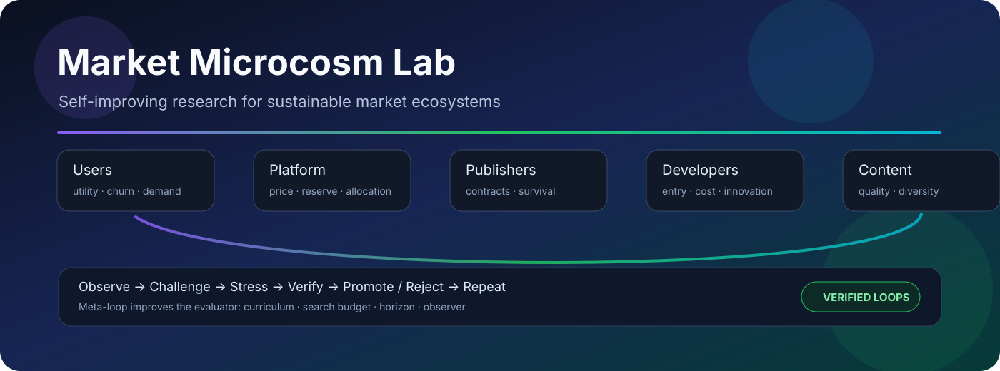
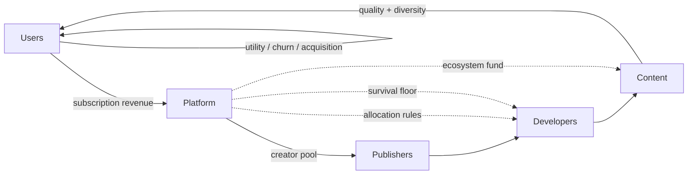
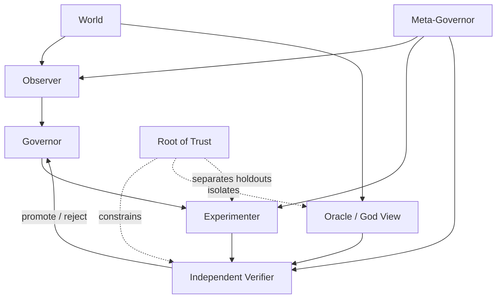

<p align="center">
  
</p>

<p align="center">
  <a href="https://github.com/hopeless-t/market-microcosm-lab/actions/workflows/ci.yml"></a>
  <a href="https://hopeless-t.github.io/market-microcosm-lab/"></a>
  
  
  
  
</p>

<p align="center">
  <strong>A self-improving research laboratory for sustainable market ecosystems.</strong><br>
  Users, developers, publishers, content, and platforms are treated as a living economic microcosm whose long-run viability must survive shocks, strategic adaptation, and imperfect observation.
</p>

<p align="center">
  <a href="https://hopeless-t.github.io/market-microcosm-lab/"><strong>Research site</strong></a>
  ·
  <a href="RESULTS.md"><strong>Current results</strong></a>
  ·
  <a href="NORTH_STAR.md"><strong>North Star</strong></a>
  ·
  <a href="ROADMAP.md"><strong>Roadmap</strong></a>
  ·
  <a href="CONTRIBUTING.md"><strong>Contributing</strong></a>
</p>

> [!IMPORTANT]
> **Evidence planes are separated.** E000–E023 are synthetic structural research worlds. E024 adds explicitly sourced empirical anchors, but calibration does not imply causal identification or policy recommendation for Netflix, Game Pass, SARTRAS, Spotify, or any named service.

## North Star

> **Discover allocation and governance rules that keep the whole ecosystem inside a robust viability region for as long as possible, under uncertainty, shocks, strategic adaptation, and imperfect observation.**

The target is not maximum one-period profit, watch time, play time, or another single proxy. The target is a market that remains worth participating in for all essential layers.

## Research dashboard

| Experiment | Question | Current signal |
| --- | --- | --- |
| **E000 · Exact World** | Can the laboratory verify itself against a fully enumerable universe? | Exact robust viability kernel + closed inner/meta loops |
| **E010 · Ecological Market** | What happens when revenue, creators, publishers, content, utility, churn, entry, and exit circulate? | Neutral survival saturated at 1.0 across all six initial mechanisms |
| **E011 · Pressure Knee** | Where does each mechanism actually break? | balanced/platform-heavy knee at 4; four other mechanisms at 3 |
| **E012 · Evaluator Meta-Loop** | Can the lab improve how it chooses mechanisms? | mild-curriculum generalized best on isolated outer stress holdout |
| **E013 · Pressure Decomposition** | Which E011 pressure component actually causes each collapse? | single-axis knees are 6–10+, much later than composite knees 3–4 |
| **E014 · Interaction Surfaces** | Can two moderate stresses cross the boundary when either alone survives? | 155 interaction-only cells across the three pairwise surfaces |
| **E015 · Adaptive Sampling** | Can the lab recover E014 with fewer expensive evaluations? | 882 → 205 queries (-76.8%) with exact recovery |
| **E016 · Adaptive Guard** | What happens when the adaptive sampler's assumptions stop being true? | generation mismatch and non-monotone audit both fail closed to exhaustive |
| **E017 · Certificate Lifecycle** | When should the expensive verifier run again? | 12-epoch stable schedule saves 51.2% while audits/expiry remain fail-closed |
| **E018 · Audit Portfolio** | Which certificates should receive scarce authoritative audit budget first? | bounded-DP matches exact oracle on 48/48 portfolios with 87.3% less search work |
| **E019 · Provenance Ledger** | Can certificate history be replayed and tampering detected? | local corruption is caught by the chain; fully rehashed history requires an external checkpoint |
| **E020 · Checkpoint Rotation** | Can external trust be rotated without forgetting older anchors? | latest-only forgery passes weak verification; pinned continuity rejects rewritten history |
| **E021 · Witness Quorum** | Can anchor authority survive one or two compromised witnesses? | 3-of-5 blocks 1–2 compromises and guarantees quorum intersection; 3 compromises reach the forge boundary |
| **E022 · Failure Domains** | Are five witness identities actually five independent failure domains? | 3-1-1 collapses to a one-domain forge; 1-1-1-1-1 requires three domains and cuts modeled forge risk 91.4% |
| **E023 · Hidden Common Mode** | Can nominally independent domains still share an undeclared dependency? | one hidden shared-KMS shock collapses the forge boundary 3→1 and inflates modeled forge probability 1016× |\n| **E024 · Empirical Evidence Plane** | Which real-world observations are allowed to constrain future calibration? | SARTRAS accounting closes to a 1-thousand-JPY rounding delta; public/restricted evidence is admission-controlled |\n| **E025 · Regional Complexity Knee** | How much regional structure is required by admitted Netflix ARM data? | exact partition search rejects 1–2 groups at 10% tolerance; 3 groups survive a one-quarter holdout |\n| **E026 · Sampling Assumption Audit** | What can SARTRAS's published sample size actually identify? | SRS gives a useful reference knee, but unknown selection admits a zero-detection adversary; sampling design metadata becomes mandatory |\n| **E027 · Metric Definition Drift** | Can public Game Pass membership headlines be compared as one time series? | naive 34/25=1.36 ratio is quarantined; bound semantics + Core-era definition change revoke precise growth authority |
| **E028 · Japanese Failure Corpus** | What breaks when failed/withdrawn Japanese SaaS evidence is admitted? | ten new failure mechanisms appear beyond price/cost/user-churn stress; negative evidence becomes mandatory |
| **E029 · Strategic Exit** | Is actor exit always an insolvency event? | empirical withdrawals plus a finite counterexample require strategic exit as a separate control action |
| **E030 · Churn Semantics** | Does higher SaaS churn always mean a worse ecosystem? | BBD churn doubles while ARR/ARPA rise under pruning; churn must be layer- and cause-typed |
| **E031 · PMF Proxy Guard** | Can revenue/high ACV/enthusiastic users certify PMF? | Srush/Leaner/SalesNow postmortems plus a finite ranking reversal reject short-run positive signals as sufficient certification |
| **E032 · Cash Conversion Lag** | Can positive booked margin still fail on liquidity timing? | fixed witness fails in month 2 before delayed cash arrives; exact survival buffer = 160 |
| **E033 · Funnel Proxy Attenuation** | Can upstream KPI attainment certify downstream value? | Leaner examples show 150%→20% and 300%→80% target attenuation; funnel stages stay separate |
| **E034 · Human Delivery Cost** | Can high ACV / software margin hide service burden? | apparent 80% margin collapses to 10% fully loaded; candidate ranking reverses |
| **E035 · Early Warning Tournament** | Which proxy detects the failure archetypes? | revenue/churn scalar rules have blind spots; five-axis negative-evidence warning matches the exact reference oracle |
| **E036 · Warning Holdout Search** | Does the warning survive broad generated scenarios? | 324 threshold candidates tuned on 500 discovery states; >98% precision/recall/F1 on untouched 500-state holdout |

See **[RESULTS.md](RESULTS.md)** for model-relative results, collapse modes, and the current theory update.

## The ecosystem



The world closes the economic cycle:

```text
users
  → subscription revenue
  → platform / creator pool
  → publishers + developers
  → content availability
  → user utility
  → churn / acquisition
  → next-period users
```

Cash buffers, operating costs, actor exit, bounded entry, content disappearance, and explicit external sources/sinks are all represented.

## The self-improving laboratory

The repository contains **two coupled closed loops**.



### L1 — ecosystem self-improvement

Observe → generate challengers → shadow simulation → untouched promotion holdout → independent verification → promote/reject → repeat.

### L2 — meta self-improvement

Alternative observers, search widths, stress curricula, horizons, and evaluation budgets run complete L1 instances. Their resulting policies compete on a **third isolated meta-holdout**.

The optimizer does not certify itself.

## Why the Oracle is not the Governor

The simulator can expose complete latent state, but a deployable policy should not receive hidden truth just because the research harness has it.

The lab therefore distinguishes:

- **World truth** — complete simulator state.
- **Operational truth** — what the Governor may observe.
- **Certification truth** — evidence independently accepted by the Verifier.

The Oracle is a checksum and upper-bound comparator, not a secret information channel.

## Mathematical anchor

For state `x`, intervention `a`, structural parameters `θ`, and disturbance `w`:

```text
x[t+1] = F_θ(x[t], a[t], w[t])
```

The core object is the **robust viability kernel**: states from which at least one policy can keep the ecosystem inside declared survival and integrity constraints under every bounded disturbance in the experiment.

E000 computes this exactly by fixed-point enumeration. Larger approximate worlds must continue to reproduce the small-world truth where both apply.

## Current synthetic findings

**Neutral worlds can lie by being too easy.** In E010 every initial mechanism survived the neutral 60-month baseline, so survival alone could not discriminate mechanisms.

**Pressure reveals ecology.** E011 exposed different knees and different collapse modes. Several creator-favoring or usage mechanisms eventually exhausted platform reserves; platform-heavy could instead preserve the platform while losing publishers and service quality.

**The evaluator is part of the system.** E012 showed that neutral-only evaluation selected a different mechanism than stress-aware evaluation. A mild-curriculum generalized better than the widest curriculum at lower search cost.

**Moderate stresses interact.** E013 separated price, platform cost, and churn. The earliest single-axis knee was 6, while E011's combined pressure broke mechanisms at 3–4. Inside this model, the joint shock reaches the viability boundary much earlier than any one component alone.

**Pairwise interaction is directly observable.** E014 found 155 cells where a pressure pair fell below 90% survival even though both matched single-axis interventions remained at or above 90%. Price × cost exposed especially clear interaction frontiers: creator-heavy failed at 2+4, usage-only/light-floor/balanced at 4+5, and platform-heavy only at 6+6.

**The experimenter can improve itself.** E015 used E014 as an exhaustive oracle and promoted a monotone staircase sampler that recovered all 882 cell classifications, all 18 frontiers, and every interaction-only count with only 205 pair-surface queries — a 76.8% reduction. Exhaustive mapping remains the periodic audit path.

**The improvement machinery can also lose authority.** E016 bound adaptive authorization to a generation fingerprint. Horizon 60 → 61 invalidated the certificate before use. A hidden non-monotone survival island reduced naive adaptive classification to 97.96%; exhaustive audit detected 23 monotonicity violations and revoked the adaptive path back to exhaustive.

**Verification has a lifecycle and a budget.** E017 turns certificate authority into deterministic evidence epochs. Auditing every 3 epochs with a hard expiry at 6 cuts a stable 12-epoch schedule from 10,584 to 5,168 queries (51.2% savings). A generation drift at epoch 5 still saves 44.8% because the changed epoch immediately recertifies exhaustively.

**Audit budget allocation also needs an oracle.** E018 compares an exhaustive portfolio scheduler, a bounded dynamic program, and a plausible greedy value-per-cost heuristic. Bounded-DP matches the exact oracle on 48/48 generated portfolios while reducing scheduler search work by 87.3%. Greedy matches only 79.2% and fails a fixed counterexample 160 vs exact 220.

**Provenance cannot self-anchor.** E019 adds an append-only SHA-256 certificate ledger. Direct payload tampering, deletion, and reordering are detected internally. But a full history rewrite with all downstream hashes recomputed remains internally consistent; only an out-of-ledger checkpoint detects the forged head and rejects the rewritten final state.

**Trust must retain continuity when anchors rotate.** E020 rotates checkpoints across a 10-event ledger at event counts 2, 4, 6, and 8. A forged latest-only checkpoint over rewritten history passes weak verification, while the same rewrite is rejected when an older independently pinned checkpoint remains part of the verification path. Deletion, reordering, and checkpoint forks are also detected.

**External anchoring can be distributed.** E021 replaces the single witness assumption with a 3-of-5 quorum. Exact enumeration shows every pair of 3-of-5 quorums intersects, while 2-of-5 admits 15 disjoint quorum pairs. One or two compromised witnesses cannot forge; three define the compromise boundary. Conflicting 3-of-5 views necessarily expose at least one equivocating witness when attestations are retained.

**Witness identities are not independent failure domains.** E022 groups the same five witnesses into correlated topologies. A 3-1-1 placement lets one domain compromise reach the three-witness threshold; 2-2-1 needs two domains; full 1-1-1-1-1 separation needs three. Under the declared independent 10% per-domain synthetic model, forge probability falls from 10.0% to 2.8% to 0.856%.

**Declared independence can itself be wrong.** E023 keeps the nominal 1-1-1-1-1 witness labels but adds one undeclared shared-KMS dependency affecting witnesses 0, 1, and 2. The minimum forge shock count collapses from 3 to 1, and the exact synthetic forge probability at a 1% shock rate rises from 0.000985% to 1.000975% — a 1016× inflation.\n\n**Empirical evidence needs its own admission plane.** E024 introduces a source registry and an exact public-source portfolio oracle. SARTRAS 2022 accounting reconciles to a 1-thousand-JPY rounding delta, Netflix regional ARM varies by more than 2× across reported Q2 2024 regions, and Game Pass Partner Center remains schema-only for public calibration because its report values require authorization.\n\n**Empirical data can choose model complexity.** E025 exhaustively enumerates every partition of Netflix's four reported regions over four discovery quarters. At a 10% maximum-relative-error tolerance, one and two ARM groups fail while three groups pass with the stable topology {UCAN}, {EMEA}, {LATAM+APAC}. Q1 2024 centroids predict the untouched Q2 2024 holdout with less than 10% maximum relative error.\n\n**Sample size is not a sampling-design certificate.** E026 uses SARTRAS's approximately 1,200 sampled institutions out of 35,130 applications. Under a hypothetical simple-random reference, 87 carrier institutions are enough to cross 95% one-or-more detection. But the same sample size has a zero-detection construction when the selection mechanism is left unconstrained, so prevalence inference fails closed until sampling-design metadata is identified.\n\n**Public numbers still need metric-version identity.** E027 places Microsoft's 2022 >25M Game Pass subscriber headline and 2024 34M member headline on opposite sides of the Xbox Live Gold → Game Pass Core conversion. The tempting 36% ratio is retained only as an illustrative anti-pattern because value semantics and definition generation do not match.

**Failure evidence changes the state space.** E028 adds Japanese negative evidence from BBD Initiative, RickCloud, Leaner, SalesNow, and TDB. Market ceiling, customer-success non-scalability, platform substitution, engineering-maintenance burden, data-strategy mismatch, labor/cash pressure, acquisition burn, product sprawl, and deliberate pruning are not represented by the original three-axis stress core.

**Exit is also a control action.** E029 shows both empirically and in a finite witness that an actor can rationally leave while cash is still positive. Future empirical worlds therefore separate forced insolvency from strategic exit/redeployment.

**Churn has semantics.** E030 uses BBD's published portfolio pruning as a sign counterexample: FY2023 Q4→FY2024 Q3 churn rises 1.15%→2.33%, yet ARR rises 1,593→1,607 million JPY and ARPA rises 437,545→466,303 JPY while contracts fall. B2B MRR churn is not silently mapped into E010 end-user churn.

**Revenue can be a PMF proxy trap.** E031 triangulates Srush, Leaner, and SalesNow postmortems: paying/high-value users, revenue, or deep customer pain can coexist with non-repeatable targeting, human-service burden, poor customer success, weak scalability, or a hard market ceiling. A finite witness reverses the winner when current revenue is replaced by multi-dimensional viability.

**Booked revenue is not cash.** E032 turns TDB's cash-conversion warning into a finite liquidity witness: monthly booked revenue 100 and cash cost 80 still fail in month 2 when collection lags by two months and initial cash is 100. Exact minimum starting cash is 160.

**Funnels attenuate.** E033 uses Leaner examples where upstream target attainment massively exceeds downstream attainment, then constructs a ranking reversal where the higher-volume funnel produces fewer successful customers.

**Human delivery is a hidden cost plane.** E034 converts Srush's high-unit-price/high-human-effort false-PMF signal into fully loaded delivery accounting. Software-only margin and true delivery margin can select opposite products.

**Negative evidence can compile into an early-warning vector.** E035 pits revenue-only, churn-only, and a five-axis multi-signal warning rule against a finite failure-archetype oracle. The scalar proxies miss or misclassify cases; the multi-signal rule exactly matches the reference suite.

**The warning survives a generated holdout.** E036 searches 324 threshold combinations on 500 discovery states and freezes the winner before evaluating 500 states from an untouched seed. Multi-signal precision, recall, and F1 remain above 98%, while revenue-only recall stays below 25% and churn-only below 30%. This is within-generator generalization, not real-company predictive validation.

That sequence matters:

```text
neutral saturation
  → pressure search
  → viability knee
  → failure biopsy
  → theory update
  → evaluator meta-improvement
  → pressure decomposition
  → interaction search
  → adaptive boundary sampling
  → adversarial guard / certificate invalidation
  → fail-closed fallback
  → certificate lifecycle / audit cadence
  → exact audit-portfolio allocation
  → durable provenance ledger
  → external checkpoint anchoring
  → checkpoint rotation / anchor continuity
  → multi-witness quorum / split-view evidence
  → correlated failure-domain analysis
  → hidden common-mode dependency audit
```

## Verification stack

The research harness is designed to make self-deception expensive.

- accounting and state invariants;
- exact finite-world oracle;
- deterministic seeded scenarios;
- replay identities;
- discovery / promotion / meta-holdout isolation;
- independent promotion gate;
- Wilson lower confidence bounds for ecological survival;
- failure-state biopsy;
- reference implementations;
- property / differential testing hooks;
- CI-generated JSON evidence.

Read **[Root of Trust](spec/ROOT_OF_TRUST.md)**, **[Validation](docs/VALIDATION.md)**, and **[Threats to Validity](docs/THREATS_TO_VALIDITY.md)** before interpreting results.

## Quickstart

Requires Python 3.11+.

```bash
git clone https://github.com/hopeless-t/market-microcosm-lab.git
cd market-microcosm-lab
python -m pip install -e ".[dev]"

pytest -q

python scripts/run_e000.py
python scripts/run_e010.py
python scripts/run_e011.py
python scripts/run_e012.py
python scripts/run_e013.py
python scripts/run_e014.py
python scripts/run_e015.py
python scripts/run_e016.py
python scripts/run_e017.py
python scripts/run_e018.py
python scripts/run_e019.py
python scripts/run_e020.py
python scripts/run_e021.py
python scripts/run_e022.py
python scripts/run_e023.py
```

GitHub Actions reruns the research chain and uploads the experiment reports as artifacts.

## Repository map

```text
market-microcosm-lab/
├── spec/                 # Root of Trust / constitutional invariants
├── src/market_microcosm/ # worlds, policies, evaluators, self-improvement
├── experiments/          # E000 / E010 / E011 / E012 / E013 / E014 / E015 / E016 / E017 / E018 / E019 / E020 / E021 / E022 / E023 / E024 / E025 / E026 / E027 / E028 / E029 / E030 / E031 / E032 / E033 / E034 / E035 / E036 protocols
├── scripts/              # executable experiment entrypoints
├── tests/                # invariants and research-harness verification
├── docs/                 # architecture + GitHub Pages site
├── wiki/                 # version-controlled Wiki source
├── RESULTS.md            # current model-relative findings
├── NORTH_STAR.md
├── ROADMAP.md
├── GOVERNANCE.md
└── CONTRIBUTING.md
```

## Research contract

A higher score is not sufficient for promotion.

A result must remain replayable, satisfy hard invariants, survive untouched evaluation, preserve Oracle isolation, retain failure cases, and state the assumptions under which it could be falsified.

> **Visualization is not evidence. Simulation output is not truth. Promotion requires independent evidence.**

## Contributing

Research hypotheses, new mechanisms, stress worlds, exact checkers, failure biopsies, and evaluator improvements are welcome.

Use the repository's **Research hypothesis** or **Failure biopsy** issue forms, and see **[CONTRIBUTING.md](CONTRIBUTING.md)** and **[GOVERNANCE.md](GOVERNANCE.md)**.

---

<p align="center">
  <strong>Build the aquarium. Stress the aquarium. Learn why it survives.</strong>
</p>
