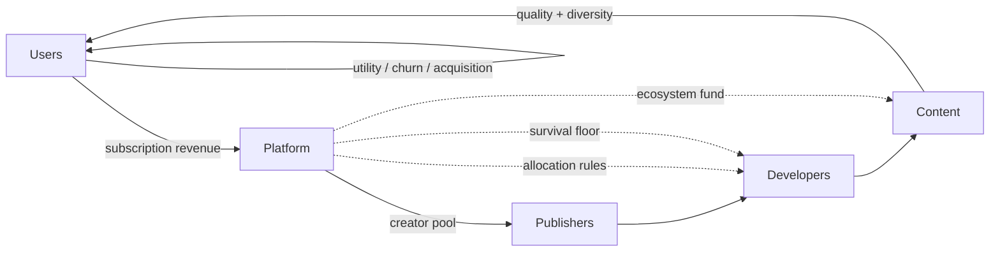
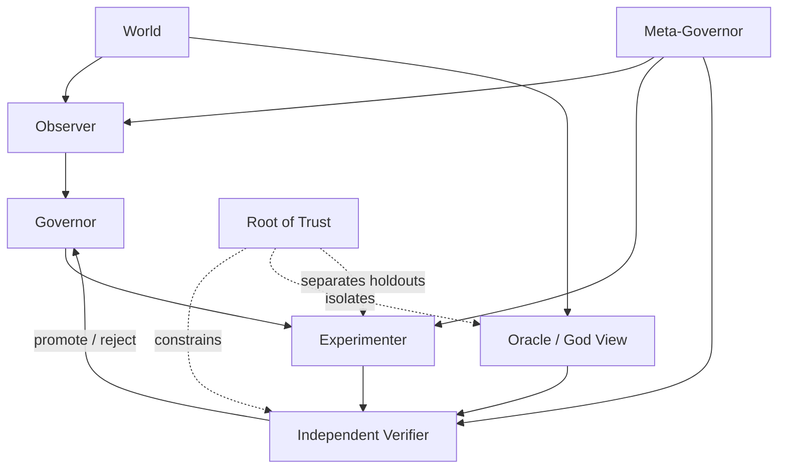

<p align="center">
  
</p>

<p align="center">
  <a href="https://github.com/hopeless-t/market-microcosm-lab/actions/workflows/ci.yml"></a>
  <a href="https://hopeless-t.github.io/market-microcosm-lab/"></a>
  
  
  
  
</p>

<p align="center">
  <strong>A self-improving research laboratory for sustainable market ecosystems.</strong><br>
  Users, developers, publishers, content, and platforms are treated as a living economic microcosm whose long-run viability must survive shocks, strategic adaptation, and imperfect observation.
</p>

<p align="center">
  <a href="https://hopeless-t.github.io/market-microcosm-lab/"><strong>Research site</strong></a>
  ·
  <a href="RESULTS.md"><strong>Current results</strong></a>
  ·
  <a href="NORTH_STAR.md"><strong>North Star</strong></a>
  ·
  <a href="ROADMAP.md"><strong>Roadmap</strong></a>
  ·
  <a href="CONTRIBUTING.md"><strong>Contributing</strong></a>
</p>

> [!IMPORTANT]
> **Evidence planes are separated.** E000–E023 are synthetic structural research worlds. E024 adds explicitly sourced empirical anchors, but calibration does not imply causal identification or policy recommendation for Netflix, Game Pass, SARTRAS, Spotify, or any named service.

## North Star

> **Discover allocation and governance rules that keep the whole ecosystem inside a robust viability region for as long as possible, under uncertainty, shocks, strategic adaptation, and imperfect observation.**

The target is not maximum one-period profit, watch time, play time, or another single proxy. The target is a market that remains worth participating in for all essential layers.

## Research dashboard

| Experiment | Question | Current signal |
| --- | --- | --- |
| **E000 · Exact World** | Can the laboratory verify itself against a fully enumerable universe? | Exact robust viability kernel + closed inner/meta loops |
| **E010 · Ecological Market** | What happens when revenue, creators, publishers, content, utility, churn, entry, and exit circulate? | Neutral survival saturated at 1.0 across all six initial mechanisms |
| **E011 · Pressure Knee** | Where does each mechanism actually break? | balanced/platform-heavy knee at 4; four other mechanisms at 3 |
| **E012 · Evaluator Meta-Loop** | Can the lab improve how it chooses mechanisms? | mild-curriculum generalized best on isolated outer stress holdout |
| **E013 · Pressure Decomposition** | Which E011 pressure component actually causes each collapse? | single-axis knees are 6–10+, much later than composite knees 3–4 |
| **E014 · Interaction Surfaces** | Can two moderate stresses cross the boundary when either alone survives? | 155 interaction-only cells across the three pairwise surfaces |
| **E015 · Adaptive Sampling** | Can the lab recover E014 with fewer expensive evaluations? | 882 → 205 queries (-76.8%) with exact recovery |
| **E016 · Adaptive Guard** | What happens when the adaptive sampler's assumptions stop being true? | generation mismatch and non-monotone audit both fail closed to exhaustive |
| **E017 · Certificate Lifecycle** | When should the expensive verifier run again? | 12-epoch stable schedule saves 51.2% while audits/expiry remain fail-closed |
| **E018 · Audit Portfolio** | Which certificates should receive scarce authoritative audit budget first? | bounded-DP matches exact oracle on 48/48 portfolios with 87.3% less search work |
| **E019 · Provenance Ledger** | Can certificate history be replayed and tampering detected? | local corruption is caught by the chain; fully rehashed history requires an external checkpoint |
| **E020 · Checkpoint Rotation** | Can external trust be rotated without forgetting older anchors? | latest-only forgery passes weak verification; pinned continuity rejects rewritten history |
| **E021 · Witness Quorum** | Can anchor authority survive one or two compromised witnesses? | 3-of-5 blocks 1–2 compromises and guarantees quorum intersection; 3 compromises reach the forge boundary |
| **E022 · Failure Domains** | Are five witness identities actually five independent failure domains? | 3-1-1 collapses to a one-domain forge; 1-1-1-1-1 requires three domains and cuts modeled forge risk 91.4% |
| **E023 · Hidden Common Mode** | Can nominally independent domains still share an undeclared dependency? | one hidden shared-KMS shock collapses the forge boundary 3→1 and inflates modeled forge probability 1016× |
| **E024 · Empirical Evidence Plane** | Which real-world observations are allowed to constrain future calibration? | SARTRAS accounting closes to a 1-thousand-JPY rounding delta; public/restricted evidence is admission-controlled |
| **E025 · Regional Complexity Knee** | How much regional structure is required by admitted Netflix ARM data? | exact partition search rejects 1–2 groups at 10% tolerance; 3 groups survive a one-quarter holdout |
| **E026 · Sampling Assumption Audit** | What can SARTRAS's published sample size actually identify? | SRS gives a useful reference knee, but unknown selection admits a zero-detection adversary; sampling design metadata becomes mandatory |
| **E027 · Metric Definition Drift** | Can public Game Pass membership headlines be compared as one time series? | naive 34/25=1.36 ratio is quarantined; bound semantics + Core-era definition change revoke precise growth authority |
| **E028 · Japanese Failure Corpus** | What breaks when failed/withdrawn Japanese SaaS evidence is admitted? | ten new failure mechanisms appear beyond price/cost/user-churn stress; negative evidence becomes mandatory |
| **E029 · Strategic Exit** | Is actor exit always an insolvency event? | empirical withdrawals plus a finite counterexample require strategic exit as a separate control action |
| **E030 · Churn Semantics** | Does higher SaaS churn always mean a worse ecosystem? | BBD churn doubles while ARR/ARPA rise under pruning; churn must be layer- and cause-typed |
| **E031 · PMF Proxy Guard** | Can revenue/high ACV/enthusiastic users certify PMF? | Srush/Leaner/SalesNow postmortems plus a finite ranking reversal reject short-run positive signals as sufficient certification |
| **E032 · Cash Conversion Lag** | Can positive booked margin still fail on liquidity timing? | fixed witness fails in month 2 before delayed cash arrives; exact survival buffer = 160 |
| **E033 · Funnel Proxy Attenuation** | Can upstream KPI attainment certify downstream value? | Leaner examples show 150%→20% and 300%→80% target attenuation; funnel stages stay separate |
| **E034 · Human Delivery Cost** | Can high ACV / software margin hide service burden? | apparent 80% margin collapses to 10% fully loaded; candidate ranking reverses |
| **E035 · Early Warning Tournament** | Which proxy detects the failure archetypes? | revenue/churn scalar rules have blind spots; five-axis negative-evidence warning matches the exact reference oracle |
| **E036 · Warning Holdout Search** | Does the warning survive broad generated scenarios? | 324 threshold candidates tuned on 500 discovery states; >98% precision/recall/F1 on untouched 500-state holdout |
| **E037 · Warning Structural Drift** | What happens when the failure law changes? | hidden interaction drops legacy recall below authority threshold; old certificate revoked and interaction-aware v2 restores >99% recall/precision |
| **E038 · Real Longitudinal Holdout** | Does component identity help on a real quarterly series? | Informetis Standard point prediction lands within one displayed million-JPY unit of Q4; E042 later limits the precision claim to reporting-resolution consistency |
| **E039 · Rolling KPI Lag** | Does the KPI itself delay observation? | a six-month trailing ARR retains 50% legacy signal three months after an abrupt end; latent state and metric kernel are separated |
| **E040 · KPI Non-identifiability** | Does one rolling ARR identify current MRR? | 338 monotone six-month paths share ARR=60 while current MRR spans 0–5; inversion is not unique |
| **E041 · Minimal Observability Checkpoint** | What one extra datum repairs the ambiguity? | exact rolling inputs + outgoing boundary MRR reconstruct newest MRR; later experiments scope this under reporting uncertainty |
| **E042 · Reporting Resolution Guard** | Can rounded chart values support sub-1% accuracy claims? | no; E038 sub-1% precision authority is revoked and replaced by interval consistency |
| **E043 · Decision-Sufficient Observability** | Must hidden state be exact to make a decision? | no; rounded state intervals can certify coarse predicates while finer thresholds remain ambiguous |
| **E044 · Robust Abstention** | What should happen when the uncertainty set straddles a boundary? | midpoint forcing is unsound; ABSTAIN becomes an authorized control output |
| **E045 · Predicate-Scoped Active Sensing** | What should be observed after ABSTAIN? | search chooses the cheapest observation that resolves the requested predicate instead of maximizing recovered state detail |
| **E046 · Authority-Constrained Sensing** | Is the cheapest resolving observation always admissible? | no; authority is a hard filter before cost optimization |
| **E047 · Temporal Evidence Alignment** | Is authorized evidence enough if it is stale or from an old metric generation? | no; freshness and generation alignment are admission constraints before cost optimization |
| **E048 · Predicate Evidence Quorum** | Can one fresh authorized attestation be final authority? | no; 3-of-5 predicate quorum across three failure domains absorbs one bad witness and ABSTAINS without quorum |
| **E049 · Upstream Source Diversity** | Are distinct witness domains enough? | no; three domains sharing one bad feed can forge a false quorum unless upstream evidence-source diversity is also required |
| **E050 · Evidence Lineage Roots** | Are three distinct source labels truly independent? | not necessarily; three sources can share one master lineage root, so quorum authority must audit upstream lineage roots |
| **E051 · Active Lineage Discovery** | Can hidden roots be discovered rather than assumed known? | bounded dependency probes expose a 3-source/3-domain common root and reopen prior independence authority |
| **E052 · Minimum Probe Portfolio** | How few probes identify the hidden-root hypothesis? | exact subset search finds ab/ac/bc as the minimum-cost 3-probe portfolio, cost 4 |
| **E053 · Noisy Probe Robustness** | Does the minimum noiseless portfolio survive one probe error? | no; distance 1 permits exact aliasing, while all 6 probes give distance 3 and correct every single error |
| **E054 · Robustness Compiler** | Can probe authority be compiled from an error budget? | yes; e=0→cost4, e=1→cost12, e=2→UNSAT under the original measurement alphabet |
| **E055 · Redundant Measurement Synthesis** | Can E054 UNSAT be repaired without weakening the error budget? | yes; 10 independent channels / cost20 synthesize distance 5 and correct every 0–2 bit error in 280 exhaustive cases |
| **E056 · Measurement Failure Domains** | Does repetition really mean independent redundancy? | no; one shared collector can flip 5 certified bits and create an exact wrong codeword; five measurement roots restore one-root tolerance |
| **E057 · Recursive Measurement Lineage** | Are E056's five measurement roots really independent? | no; three roots share a hidden observability super-root whose fault can flip six certified channels |
| **E058 · Recursive Lineage Repair** | How should a discovered super-root be repaired? | exact migration synthesis moves root-1/root-2 for cost 5 and restores the original two-bit budget |
| **E059 · Dependency-Depth Stopping** | How deep should recursive dependency audit continue? | stop at the minimum depth whose maximum unverified blast fits the downstream correction budget; depth 2 / cost 5 |
| **E060 · Heterogeneous Audit Allocation** | Must every dependency branch be audited equally deeply? | no; proof-obligation-specific depth halves cost from 16 to 8 |
| **E061 · Coupled Audit Bundles** | Are branch audits really independent? | no; shared audit bundles reduce the exact safe cover from cost 8 to cost 6 |
| **E062 · Audit Evidence Failure Domains** | Can shared audit evidence fail as one common-mode artifact? | yes; E061 cost-6 plan has proof blast 2; exact safe optimum is cost 8 with one shared bundle plus independent corroboration |
| **E063 · Real Portfolio Transition** | Can churn direction certify ARR/portfolio direction inside one company-year? | no; BBD FY2025 shows churn-down with ARR-up and churn-down with ARR-down under one metric generation |
| **E064 · Prospective Evidence Cutoff** | Can Q4 explanations be used in a Q3 warning? | no; future-only annotations are valid for retrospective explanation but rejected as prospective features |
| **E065 · Public Warning Sufficiency** | Does public Q3 IR cover the five structural warning axes? | no; 0/5 direct coverage, so the public-data evaluator ABSTAINS instead of imputing hidden state |
| **E066 · Partial Public Evidence** | Does 0/5 direct mean zero useful structural evidence? | no; public portfolio finds 2 partial axes / 3 absent axes; direct coverage remains 0 and warning authority still ABSTAINS |
| **E067 · Direct Evidence Acquisition** | What should ABSTAIN request next? | exact authority-constrained portfolio rejects cheap raw board minutes and selects finance-pack + gtm-pack + signed strategy attestation, cost 14 |
| **E068 · Decision-Sufficient Acquisition** | Must every warning decision recover all five axes? | no; one failing-axis witness can certify WARN at cost 2–5, while SAFE still requires full cost-14 coverage |
| **E069 · Sequential Acquisition Policy** | Which evidence should be requested first without knowing the bad axis? | exact DP chooses GTM → strategy → finance on the safe path; expected cost 9.0225 vs 9.32385 cost-order and 14 static |
| **E070 · Prior-Drift Revocation** | Does the E069 order survive failure-distribution shift? | no; finance/strategy shifts change the optimal first action and produce frozen-policy regret >3.7 / >1.5, revoking prior-scoped authority |
| **E071 · Minimax Prior-Set Policy** | Can one order remain useful across all admitted priors? | exact 6-order search selects strategy → finance → GTM; worst-case cost 11.315 and regret 2.2925, beating frozen E069 at the price of reference efficiency |
| **E072 · Joint Dependence Attack** | Do identical marginal failure priors identify the same policy? | no; same marginals but headroom/exit dependence reorders GTM → strategy → finance into GTM → finance → strategy and saves 0.75 expected cost |
| **E073 · Robustness Certificate Split** | Does E071 survive when E072 is added to the uncertainty set? | order survives at strategy → finance → GTM and worst-case cost 11.315, but worst-case regret expands 2.2925 → 2.70 so the bound is reissued |
| **E074 · Dependence Ambiguity** | What if joint dependence is completely unknown at fixed marginals? | tight Fréchet minimax gives two GTM-first orders at worst-case cost 11.0; reference-efficiency tie-break recovers GTM → strategy → finance |

See **[RESULTS.md](RESULTS.md)** for model-relative results, collapse modes, and the current theory update.

## The ecosystem



The world closes the economic cycle:

```text
users
  → subscription revenue
  → platform / creator pool
  → publishers + developers
  → content availability
  → user utility
  → churn / acquisition
  → next-period users
```

Cash buffers, operating costs, actor exit, bounded entry, content disappearance, and explicit external sources/sinks are all represented.

## The self-improving laboratory

The repository contains **two coupled closed loops**.



### L1 — ecosystem self-improvement

Observe → generate challengers → shadow simulation → untouched promotion holdout → independent verification → promote/reject → repeat.

### L2 — meta self-improvement

Alternative observers, search widths, stress curricula, horizons, and evaluation budgets run complete L1 instances. Their resulting policies compete on a **third isolated meta-holdout**.

The optimizer does not certify itself.

## Why the Oracle is not the Governor

The simulator can expose complete latent state, but a deployable policy should not receive hidden truth just because the research harness has it.

The lab therefore distinguishes:

- **World truth** — complete simulator state.
- **Operational truth** — what the Governor may observe.
- **Certification truth** — evidence independently accepted by the Verifier.

The Oracle is a checksum and upper-bound comparator, not a secret information channel.

## Mathematical anchor

For state `x`, intervention `a`, structural parameters `θ`, and disturbance `w`:

```text
x[t+1] = F_θ(x[t], a[t], w[t])
```

The core object is the **robust viability kernel**: states from which at least one policy can keep the ecosystem inside declared survival and integrity constraints under every bounded disturbance in the experiment.

E000 computes this exactly by fixed-point enumeration. Larger approximate worlds must continue to reproduce the small-world truth where both apply.

## Current synthetic findings

**Neutral worlds can lie by being too easy.** In E010 every initial mechanism survived the neutral 60-month baseline, so survival alone could not discriminate mechanisms.

**Pressure reveals ecology.** E011 exposed different knees and different collapse modes. Several creator-favoring or usage mechanisms eventually exhausted platform reserves; platform-heavy could instead preserve the platform while losing publishers and service quality.

**The evaluator is part of the system.** E012 showed that neutral-only evaluation selected a different mechanism than stress-aware evaluation. A mild-curriculum generalized better than the widest curriculum at lower search cost.

**Moderate stresses interact.** E013 separated price, platform cost, and churn. The earliest single-axis knee was 6, while E011's combined pressure broke mechanisms at 3–4. Inside this model, the joint shock reaches the viability boundary much earlier than any one component alone.

**Pairwise interaction is directly observable.** E014 found 155 cells where a pressure pair fell below 90% survival even though both matched single-axis interventions remained at or above 90%. Price × cost exposed especially clear interaction frontiers: creator-heavy failed at 2+4, usage-only/light-floor/balanced at 4+5, and platform-heavy only at 6+6.

**The experimenter can improve itself.** E015 used E014 as an exhaustive oracle and promoted a monotone staircase sampler that recovered all 882 cell classifications, all 18 frontiers, and every interaction-only count with only 205 pair-surface queries — a 76.8% reduction. Exhaustive mapping remains the periodic audit path.

**The improvement machinery can also lose authority.** E016 bound adaptive authorization to a generation fingerprint. Horizon 60 → 61 invalidated the certificate before use. A hidden non-monotone survival island reduced naive adaptive classification to 97.96%; exhaustive audit detected 23 monotonicity violations and revoked the adaptive path back to exhaustive.

**Verification has a lifecycle and a budget.** E017 turns certificate authority into deterministic evidence epochs. Auditing every 3 epochs with a hard expiry at 6 cuts a stable 12-epoch schedule from 10,584 to 5,168 queries (51.2% savings). A generation drift at epoch 5 still saves 44.8% because the changed epoch immediately recertifies exhaustively.

**Audit budget allocation also needs an oracle.** E018 compares an exhaustive portfolio scheduler, a bounded dynamic program, and a plausible greedy value-per-cost heuristic. Bounded-DP matches the exact oracle on 48/48 generated portfolios while reducing scheduler search work by 87.3%. Greedy matches only 79.2% and fails a fixed counterexample 160 vs exact 220.

**Provenance cannot self-anchor.** E019 adds an append-only SHA-256 certificate ledger. Direct payload tampering, deletion, and reordering are detected internally. But a full history rewrite with all downstream hashes recomputed remains internally consistent; only an out-of-ledger checkpoint detects the forged head and rejects the rewritten final state.

**Trust must retain continuity when anchors rotate.** E020 rotates checkpoints across a 10-event ledger at event counts 2, 4, 6, and 8. A forged latest-only checkpoint over rewritten history passes weak verification, while the same rewrite is rejected when an older independently pinned checkpoint remains part of the verification path. Deletion, reordering, and checkpoint forks are also detected.

**External anchoring can be distributed.** E021 replaces the single witness assumption with a 3-of-5 quorum. Exact enumeration shows every pair of 3-of-5 quorums intersects, while 2-of-5 admits 15 disjoint quorum pairs. One or two compromised witnesses cannot forge; three define the compromise boundary. Conflicting 3-of-5 views necessarily expose at least one equivocating witness when attestations are retained.

**Witness identities are not independent failure domains.** E022 groups the same five witnesses into correlated topologies. A 3-1-1 placement lets one domain compromise reach the three-witness threshold; 2-2-1 needs two domains; full 1-1-1-1-1 separation needs three. Under the declared independent 10% per-domain synthetic model, forge probability falls from 10.0% to 2.8% to 0.856%.

**Declared independence can itself be wrong.** E023 keeps the nominal 1-1-1-1-1 witness labels but adds one undeclared shared-KMS dependency affecting witnesses 0, 1, and 2. The minimum forge shock count collapses from 3 to 1, and the exact synthetic forge probability at a 1% shock rate rises from 0.000985% to 1.000975% — a 1016× inflation.

**Empirical evidence needs its own admission plane.** E024 introduces a source registry and an exact public-source portfolio oracle. SARTRAS 2022 accounting reconciles to a 1-thousand-JPY rounding delta, Netflix regional ARM varies by more than 2× across reported Q2 2024 regions, and Game Pass Partner Center remains schema-only for public calibration because its report values require authorization.

**Empirical data can choose model complexity.** E025 exhaustively enumerates every partition of Netflix's four reported regions over four discovery quarters. At a 10% maximum-relative-error tolerance, one and two ARM groups fail while three groups pass with the stable topology {UCAN}, {EMEA}, {LATAM+APAC}. Q1 2024 centroids predict the untouched Q2 2024 holdout with less than 10% maximum relative error.

**Sample size is not a sampling-design certificate.** E026 uses SARTRAS's approximately 1,200 sampled institutions out of 35,130 applications. Under a hypothetical simple-random reference, 87 carrier institutions are enough to cross 95% one-or-more detection. But the same sample size has a zero-detection construction when the selection mechanism is left unconstrained, so prevalence inference fails closed until sampling-design metadata is identified.

**Public numbers still need metric-version identity.** E027 places Microsoft's 2022 >25M Game Pass subscriber headline and 2024 34M member headline on opposite sides of the Xbox Live Gold → Game Pass Core conversion. The tempting 36% ratio is retained only as an illustrative anti-pattern because value semantics and definition generation do not match.

**Failure evidence changes the state space.** E028 adds Japanese negative evidence from BBD Initiative, RickCloud, Leaner, SalesNow, and TDB. Market ceiling, customer-success non-scalability, platform substitution, engineering-maintenance burden, data-strategy mismatch, labor/cash pressure, acquisition burn, product sprawl, and deliberate pruning are not represented by the original three-axis stress core.

**Exit is also a control action.** E029 shows both empirically and in a finite witness that an actor can rationally leave while cash is still positive. Future empirical worlds therefore separate forced insolvency from strategic exit/redeployment.

**Churn has semantics.** E030 uses BBD's published portfolio pruning as a sign counterexample: FY2023 Q4→FY2024 Q3 churn rises 1.15%→2.33%, yet ARR rises 1,593→1,607 million JPY and ARPA rises 437,545→466,303 JPY while contracts fall. B2B MRR churn is not silently mapped into E010 end-user churn.

**Revenue can be a PMF proxy trap.** E031 triangulates Srush, Leaner, and SalesNow postmortems: paying/high-value users, revenue, or deep customer pain can coexist with non-repeatable targeting, human-service burden, poor customer success, weak scalability, or a hard market ceiling. A finite witness reverses the winner when current revenue is replaced by multi-dimensional viability.

**Booked revenue is not cash.** E032 turns TDB's cash-conversion warning into a finite liquidity witness: monthly booked revenue 100 and cash cost 80 still fail in month 2 when collection lags by two months and initial cash is 100. Exact minimum starting cash is 160.

**Funnels attenuate.** E033 uses Leaner examples where upstream target attainment massively exceeds downstream attainment, then constructs a ranking reversal where the higher-volume funnel produces fewer successful customers.

**Human delivery is a hidden cost plane.** E034 converts Srush's high-unit-price/high-human-effort false-PMF signal into fully loaded delivery accounting. Software-only margin and true delivery margin can select opposite products.

**Negative evidence can compile into an early-warning vector.** E035 pits revenue-only, churn-only, and a five-axis multi-signal warning rule against a finite failure-archetype oracle. The scalar proxies miss or misclassify cases; the multi-signal rule exactly matches the reference suite.

**The warning survives a generated holdout.** E036 searches 324 threshold combinations on 500 discovery states and freezes the winner before evaluating 500 states from an untouched seed. Multi-signal precision, recall, and F1 remain above 98%, while revenue-only recall stays below 25% and churn-only below 30%. This is within-generator generalization, not real-company predictive validation.

**A new failure law revokes the warning.** E037 mutates the generator with an interaction-only `market_headroom × downstream_success` failure. The frozen E036 warning drops below its prior recall authority threshold and is explicitly revoked. Adding the interaction term restores >99% recall and precision, promoting warning generation v2.

**The first real quarterly holdout is component-scoped.** E038 uses Informetis's published ARR series. A constant-retention point model fit only on 2025-Q1→Q3 Smart Living Standard predicts Q4 at about 215.27 million JPY versus a displayed 216. The same simple decay story fails badly on Smart Living Light, so the mechanism is kept component-scoped. E042 later revokes interpreting the sub-1% point gap as source-supported empirical precision because the chart itself is only displayed to integer million JPY.

**The KPI can lag the business state.** E039 models Informetis's published ARR definition — twelve times the trailing six-month average MRR. Three months after an abrupt component MRR end, a six-month window still contains 50% pre-end signal. Early-warning lead time must therefore include the metric measurement kernel, not just event and publication timestamps.

**Rolling KPI inversion is non-identifiable.** E040 exactly enumerates monotone six-month integer MRR paths with average MRR=5. There are 338 compatible paths for the identical reported ARR=60, and current MRR can be any value from 0 to 5.

**One indispensable boundary checkpoint repairs one-step observability.** E041 shows that consecutive exact rolling ARR values reveal only `newest - outgoing`. Retaining the one MRR value leaving the window makes `newest = current_sum - previous_sum + outgoing` exact. The full historical path is unnecessary for that exact-input task.

**Reported precision can revoke a successful-looking result.** E042 propagates million-JPY display rounding through E038. The decay prediction interval overlaps the displayed Q4 interval, so consistency survives, but the apparent 0.34% accuracy authority is explicitly REVOKED.

**Observability is decision-scoped.** E043 propagates rounding through the E041 reconstruction: the newest MRR becomes an interval rather than a point. `MRR > 0` is still certified, while `MRR >= 2` remains ambiguous.

**Ambiguity is allowed to stop the controller.** E044 makes ABSTAIN a first-class output and proves that midpoint-forcing can disagree with a compatible latent state.

**ABSTAIN triggers targeted sensing, not maximal sensing.** E045 searches candidate observations by declared information cost and selects the cheapest predicate-sufficient observation; full-state recovery loses priority when cheaper decision-native evidence is enough.

**Cheap evidence can still be inadmissible.** E046 shows that a cost-only optimizer selects unauthorized raw-ledger evidence. Active sensing is corrected to filter authorization and predicate resolution before cost minimization.

**Authorized evidence can still be temporally wrong.** E047 adds freshness and metric-generation alignment before cost optimization. Evidence that is stale or defined under an obsolete metric generation is rejected even if it is authorized and predicate-resolving.

**One signed predicate is still not final authority.** E048 applies the earlier witness-quorum machinery to active sensing: 3 matching votes across 3 declared failure domains are required, and unresolved conflicts ABSTAIN.

**Witness diversity is not evidence-source diversity.** E049 constructs a false 3-domain quorum whose three witnesses all consume one corrupted upstream feed. The false view loses authority when the verifier also requires three distinct upstream evidence sources.

**Source names are not lineage independence.** E050 pushes the graph one layer deeper: `source-a`, `source-b`, and `source-c` can all derive from one `master-warehouse`. A source-diverse quorum can still be one-root fragile, so accepted evidence must expose and diversify upstream lineage roots.

**Hidden lineage can be discovered actively.** E051 introduces bounded dependency probes. A candidate-root perturbation that simultaneously affects at least three sources across at least three witness domains creates evidence of a hidden common root and revokes the prior independence assumption.

**Discovery itself can be optimized.** E052 treats hidden-lineage discovery as experiment design and exactly searches probe subsets. The minimum-cost noiseless identifying portfolio is `ab/ac/bc`, three probes with total declared cost 4.

**Minimum identification is not minimum robust identification.** E053 flips one probe bit and turns the E052 `none=000` signature into the exact `shared-bcd=001` signature. One-error correction requires signature distance 3; only all six pair probes satisfy it in the reference world.

**Robustness is compiled from the declared threat budget.** E054 maps tolerated substitution errors `e` to required Hamming distance `2e+1`, then exactly searches the minimum portfolio. `e=2` is explicitly UNSAT under the six-probe alphabet.

**UNSAT can trigger measurement redesign rather than silent downgrade.** E055 allows independent repeated measurement channels. Exact synthesis finds a ten-channel, cost-20 distance-five design and exhaustively recovers all five hypotheses under every zero-, one-, and two-bit error pattern.

**Bit distance is not failure-domain distance.** E056 places five of those certified channels behind one shared collector. One root fault flips five bits and turns the `none` codeword into exact `shared-abc`. The repaired topology caps one root at two channels; ten channels therefore require at least five roots, and all 25 single-root-fault cases decode correctly.

**Failure-domain independence is recursive.** E057 probes the five admitted measurement roots and discovers that root-0/root-1/root-2 still share one `shared-observability-plane`. One super-root fault can corrupt six channels, so E056 authority is revoked.

**Discovery is followed by topology repair, not threat-budget inflation.** E058 exactly enumerates migration subsets and moves root-1/root-2 onto fresh providers for minimum cost 5. Every single-provider fault returns to two channels.

**Recursive audit gets an explicit stopping certificate.** E059 audits only until the maximum unverified correlated blast fits the downstream two-channel correction budget. Depth 2 / cost 5 is sufficient; depth 3 costs more without improving that bound.

**Audit depth is proof-obligation specific.** E060 lets network, identity, power, vendor, and operator branches use different audit depths. Exact allocation costs 8 versus 16 for uniform deep audit.

**Shared evidence couples audit allocation.** E061 adds audit bundles that cover multiple proof obligations. Exact set-cover chooses two shared bundles for cost 6, beating the E060 branch-separable optimum.

**Shared evidence is also a failure domain.** E062 treats one audit artifact failure as a common-mode event. Each E061 bundle is the sole support for two obligations, so its proof blast is 2. Under a one-obligation blast budget, the cost-6 authority is revoked. The exact cost-8 repair still reuses the control-plane bundle, but independently corroborates identity so one artifact failure can strand at most one obligation.

**Real portfolio transitions scramble KPI signs.** E063 uses BBD FY2025 Q1–Q4. Churn improvement coexists once with ARR growth and later with ARR decline, while contracts fall every quarter; the same KPI sign is not a health label.

**Retrospective explanation is not prospective evidence.** E064 timestamps public evidence around the Q3 decision cutoff. Q4 launch-delay and withdrawal-preparation annotations remain useful explanations but are future leakage for a Q3 warning.

**The public dataset may be too weak for the structural model.** E065 compares public Q3 IR with the five-axis warning feature contract. None of the five structural axes is directly observed, so public-only warning authority is ABSTAIN rather than proxy imputation.

**Zero direct coverage is not zero information.** E066 refines the same Q3 material into direct / partial / absent support. Gross-margin/cost evidence partially informs delivery economics and TAM/SAM/SOM context partially informs market headroom. Coverage becomes direct 0 / partial 2 / absent 3; partial evidence can guide acquisition but cannot satisfy the direct warning contract.

**ABSTAIN now compiles into an evidence request.** E067 searches direct-evidence bundles. A naive cost-only plan uses unauthorized raw board minutes and is rejected. The minimum authorized complete plan is finance-pack + gtm-pack + signed strategy-gap attestation at declared cost 14, cheaper than a broad dataroom query.

**Full feature recovery is not always decision-minimal.** E068 gives the five-axis warning OR semantics. Any directly observed failing axis can certify WARN, so single-failure reference worlds need only cost 2–5. SAFE remains harder: all five axes must be directly observed and the minimum stays cost 14.

**The deployable problem is sequential.** E069 removes E068's oracle advantage. Under synthetic axis-failure priors, exact DP orders GTM → strategy → finance on the all-safe path. Expected cost is 9.0225 versus 9.32385 for cost-only bundle ordering and 14 for static full acquisition; the all-safe path still costs 14, preserving SAFE authority.

**Sequential-policy authority is prior-scoped.** E070 freezes E069 and shifts the failure distribution. A finance-heavy generation changes the optimum to finance-first and creates >3.7 expected-cost regret; a strategy-heavy generation changes the optimum to strategy-first with >1.5 regret. Both exceed the declared revocation threshold, so the frozen policy must be recompiled.

**Robust acquisition trades efficiency for stability.** E071 searches every ordering of the three complete-coverage bundles across the admitted prior set. Strategy → finance → GTM minimizes worst-case cost at 11.315 and worst-case regret at 2.2925, improving E069's worst-case behavior while deliberately sacrificing reference-prior efficiency.

**Marginals do not identify the sequential policy.** E072 holds every E069 axis-failure probability fixed but introduces headroom/strategic-exit dependence. The joint-aware optimum becomes GTM → finance → strategy at cost 8.45; the marginal-only E069 order costs 9.20. Conditional dependence therefore belongs in the evidence-policy state.

**Policy identity and performance bounds have separate authority.** E073 adds the E072 adversary to E071's uncertainty set and reruns all six bundle orders. Strategy → finance → GTM still wins and worst-case cost stays 11.315, but worst-case regret widens from 2.2925 to 2.70. The order is retained while its old regret certificate is reissued.

**Dependence uncertainty can be certified without guessing one joint model.** E074 ranges over every joint distribution consistent with the E069 marginals. Tight Fréchet prefix bounds are witnessed by nested bad events. Both GTM-first orders have worst-case cost 11.0; reference-prior efficiency breaks the tie and recovers GTM → strategy → finance.

That sequence matters:

```text
neutral saturation
  → pressure search
  → viability knee
  → failure biopsy
  → theory update
  → evaluator meta-improvement
  → pressure decomposition
  → interaction search
  → adaptive boundary sampling
  → adversarial guard / certificate invalidation
  → fail-closed fallback
  → certificate lifecycle / audit cadence
  → exact audit-portfolio allocation
  → durable provenance ledger
  → external checkpoint anchoring
  → checkpoint rotation / anchor continuity
  → multi-witness quorum / split-view evidence
  → correlated failure-domain analysis
  → hidden common-mode dependency audit
```

## Verification stack

The research harness is designed to make self-deception expensive.

- accounting and state invariants;
- exact finite-world oracle;
- deterministic seeded scenarios;
- replay identities;
- discovery / promotion / meta-holdout isolation;
- independent promotion gate;
- Wilson lower confidence bounds for ecological survival;
- failure-state biopsy;
- reference implementations;
- property / differential testing hooks;
- CI-generated JSON evidence.

Read **[Root of Trust](spec/ROOT_OF_TRUST.md)**, **[Validation](docs/VALIDATION.md)**, and **[Threats to Validity](docs/THREATS_TO_VALIDITY.md)** before interpreting results.

## Quickstart

Requires Python 3.11+.

```bash
git clone https://github.com/hopeless-t/market-microcosm-lab.git
cd market-microcosm-lab
python -m pip install -e ".[dev]"

pytest -q

python scripts/run_e000.py
python scripts/run_e010.py
python scripts/run_e011.py
python scripts/run_e012.py
python scripts/run_e013.py
python scripts/run_e014.py
python scripts/run_e015.py
python scripts/run_e016.py
python scripts/run_e017.py
python scripts/run_e018.py
python scripts/run_e019.py
python scripts/run_e020.py
python scripts/run_e021.py
python scripts/run_e022.py
python scripts/run_e023.py
python scripts/run_e024.py
python scripts/run_e025.py
python scripts/run_e026.py
python scripts/run_e027.py
python scripts/run_e028.py
python scripts/run_e029.py
python scripts/run_e030.py
python scripts/run_e031.py
python scripts/run_e032.py
python scripts/run_e033.py
python scripts/run_e034.py
python scripts/run_e035.py
python scripts/run_e036.py
python scripts/run_e037.py
python scripts/run_e038.py
python scripts/run_e039.py
python scripts/run_e040.py
python scripts/run_e041.py
python scripts/run_e042.py
python scripts/run_e043.py
python scripts/run_e044.py
python scripts/run_e045.py
python scripts/run_e046.py
python scripts/run_e047.py
python scripts/run_e048.py
python scripts/run_e049.py
python scripts/run_e050.py
python scripts/run_e051.py
python scripts/run_e052.py
python scripts/run_e053.py
python scripts/run_e054.py
python scripts/run_e055.py
python scripts/run_e056.py
python scripts/run_e057.py
python scripts/run_e058.py
python scripts/run_e059.py
python scripts/run_e060.py
python scripts/run_e061.py
python scripts/run_e062.py
python scripts/run_e063.py
python scripts/run_e064.py
python scripts/run_e065.py
python scripts/run_e066.py
python scripts/run_e067.py
python scripts/run_e068.py
python scripts/run_e069.py
python scripts/run_e070.py
python scripts/run_e071.py
python scripts/run_e072.py
python scripts/run_e073.py
python scripts/run_e074.py
```

GitHub Actions reruns the research chain and uploads the experiment reports as artifacts.

## Repository map

```text
market-microcosm-lab/
├── spec/                 # Root of Trust / constitutional invariants
├── src/market_microcosm/ # worlds, policies, evaluators, self-improvement
├── experiments/          # E000 / E010 / E011 / E012 / E013 / E014 / E015 / E016 / E017 / E018 / E019 / E020 / E021 / E022 / E023 / E024 / E025 / E026 / E027 / E028 / E029 / E030 / E031 / E032 / E033 / E034 / E035 / E036 / E037 / E038 / E039 / E040 / E041 / E042 / E043 / E044 / E045 / E046 / E047 / E048 / E049 / E050 / E051 / E052 / E053 / E054 / E055 / E056 / E057 / E058 / E059 / E060 / E061 / E062 / E063 / E064 / E065 / E066 / E067 / E068 / E069 / E070 / E071 / E072 / E073 / E074 protocols
├── scripts/              # executable experiment entrypoints
├── tests/                # invariants and research-harness verification
├── docs/                 # architecture + GitHub Pages site
├── wiki/                 # version-controlled Wiki source
├── RESULTS.md            # current model-relative findings
├── NORTH_STAR.md
├── ROADMAP.md
├── GOVERNANCE.md
└── CONTRIBUTING.md
```

## Research contract

A higher score is not sufficient for promotion.

A result must remain replayable, satisfy hard invariants, survive untouched evaluation, preserve Oracle isolation, retain failure cases, and state the assumptions under which it could be falsified.

> **Visualization is not evidence. Simulation output is not truth. Promotion requires independent evidence.**

## Contributing

Research hypotheses, new mechanisms, stress worlds, exact checkers, failure biopsies, and evaluator improvements are welcome.

Use the repository's **Research hypothesis** or **Failure biopsy** issue forms, and see **[CONTRIBUTING.md](CONTRIBUTING.md)** and **[GOVERNANCE.md](GOVERNANCE.md)**.

---

<p align="center">
  <strong>Build the aquarium. Stress the aquarium. Learn why it survives.</strong>
</p>
