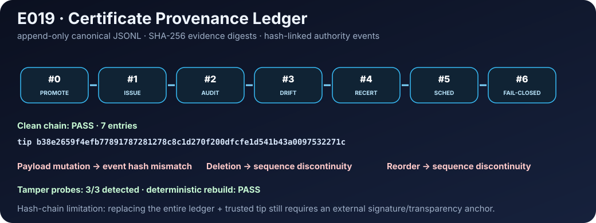



# Research Dashboard

This page exposes the current **model-relative** E011–E019 result surfaces. The underlying assets are deterministically generated from experiment JSON and checked by CI.

[View the generated table](generated/research-dashboard.md) · [Read the full results on GitHub](https://github.com/hopeless-t/market-microcosm-lab/blob/main/RESULTS.md)

> Synthetic evidence only. These figures summarize declared research worlds, not real-market recommendations.
