# Generated research dashboard

> Generated from E011/E012/E013/E014/E015/E016/E017/E018/E019/E020/E021/E022/E023 report JSON by `scripts/render_research_dashboard.py`.
> Do not hand-edit this file.

## E011 — pressure resilience

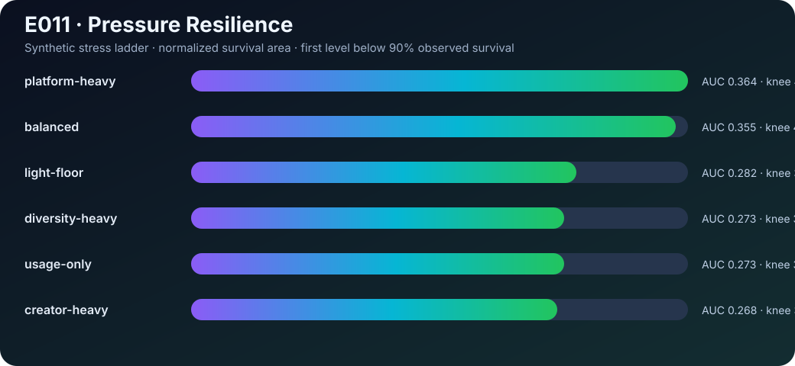

| Mechanism | Survival AUC | Preliminary knee |
| --- | ---: | ---: |
| platform-heavy | 0.364 | 4 |
| balanced | 0.355 | 4 |
| light-floor | 0.282 | 3 |
| diversity-heavy | 0.273 | 3 |
| usage-only | 0.273 | 3 |
| creator-heavy | 0.268 | 3 |

## E012 — evaluator meta-improvement

| Evaluation curriculum | Mechanism selected |
| --- | --- |
| neutral-only | balanced |
| mild-curriculum | platform-heavy |
| boundary-curriculum | platform-heavy |

**Outer winner:** mild-curriculum → platform-heavy

## E013 — one-dimensional pressure decomposition

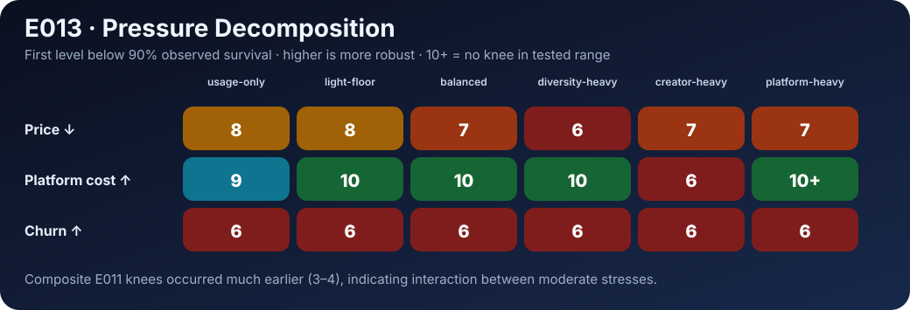

| Axis | usage-only | light-floor | balanced | diversity-heavy | creator-heavy | platform-heavy |
| --- | ---: | ---: | ---: | ---: | ---: | ---: |
| Price ↓ | 8 | 8 | 7 | 6 | 7 | 7 |
| Platform cost ↑ | 9 | 10 | 10 | 10 | 6 | 10+ |
| Churn ↑ | 6 | 6 | 6 | 6 | 6 | 6 |

Composite E011 knees were 3–4, while the earliest E013 single-axis knee is 6. That gap is evidence of interaction inside the declared synthetic world.

## E014 — pairwise interaction surfaces

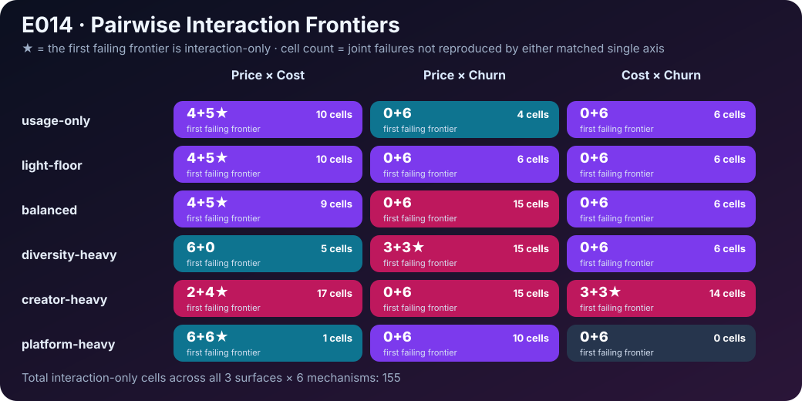

| Mechanism | Price × Cost | Price × Churn | Cost × Churn |
| --- | ---: | ---: | ---: |
| usage-only | 4+5★ · 10 | 0+6 · 4 | 0+6 · 6 |
| light-floor | 4+5★ · 10 | 0+6 · 6 | 0+6 · 6 |
| balanced | 4+5★ · 9 | 0+6 · 15 | 0+6 · 6 |
| diversity-heavy | 6+0 · 5 | 3+3★ · 15 | 0+6 · 6 |
| creator-heavy | 2+4★ · 17 | 0+6 · 15 | 3+3★ · 14 |
| platform-heavy | 6+6★ · 1 | 0+6 · 10 | 0+6 · 0 |

Each cell is `frontier level_a+level_b · interaction-only cell count`. ★ means the first failing frontier itself is interaction-only.

**Total interaction-only cells:** 155

## E015 — adaptive boundary sampling

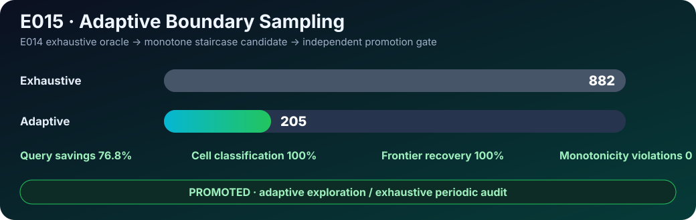

| Metric | Exhaustive | Adaptive |
| --- | ---: | ---: |
| Pair-surface queries | 882 | 205 |
| Mean queries / surface | 49.0 | 11.39 |

- Query savings: **76.8%**
- Cell classification accuracy: **100%**
- Exact frontier recovery: **100%**
- Monotonicity violations: **0**
- Promotion: **PASS**

## E016 — generation-scoped adaptive guard

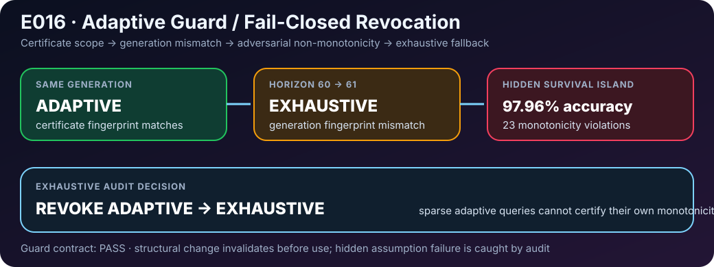

| Guard case | Decision |
| --- | --- |
| Same generation fingerprint | **adaptive** |
| Horizon 60 → 61 | **exhaustive** |
| Hidden non-monotone island | naive accuracy **97.96%** |
| Exhaustive audit | **23 violations detected** |
| Post-audit mode | **exhaustive** |

Guard contract: **PASS**.

## E017 — certificate lifecycle and audit cadence

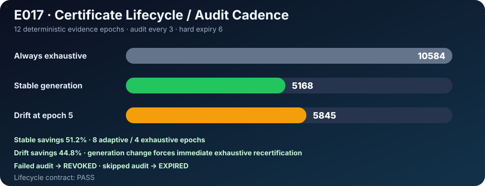

| Schedule | Queries | Savings vs always exhaustive |
| --- | ---: | ---: |
| Always exhaustive | 10584 | 0% |
| Stable generation | 5168 | 51.2% |
| Drift at epoch 5 | 5845 | 44.8% |

- Stable schedule: **8 adaptive / 4 exhaustive epochs**
- Failed audit: **REVOKED → exhaustive**
- Skipped audit through hard expiry: **EXPIRED → exhaustive**
- Lifecycle contract: **PASS**

## E018 — audit portfolio scheduler

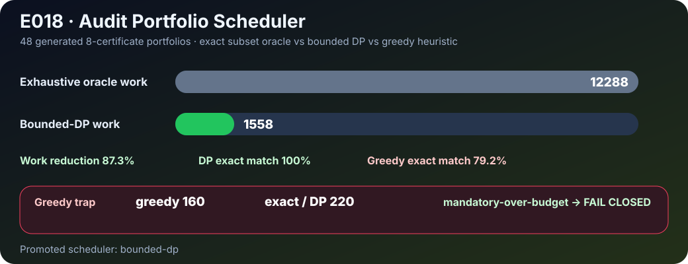

| Scheduler | Exact match | Search work |
| --- | ---: | ---: |
| Exhaustive oracle | 100% | 12288 |
| Bounded-DP | 100% | 1558 |
| Greedy value/cost | 79.2% | heuristic |

- DP work reduction: **87.3%**
- Fixed greedy trap: **160 vs exact 220**
- Mandatory-over-budget: **FAIL CLOSED**
- Promoted scheduler: **bounded-dp**

## E019 — durable certificate provenance ledger

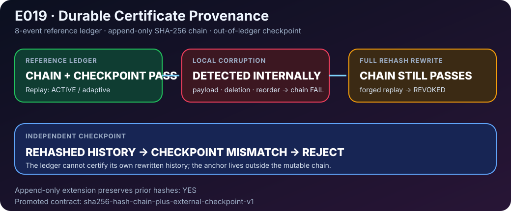

| Integrity case | Internal chain | External checkpoint |
| --- | --- | --- |
| Reference history | **PASS** | **PASS** |
| Payload tamper | **FAIL** | not needed |
| Event deletion | **FAIL** | not needed |
| Event reorder | **FAIL** | not needed |
| Full rewrite + downstream rehash | **PASS** | **FAIL / detected** |

- Reference replay: **ACTIVE / adaptive**
- Rehashed forged replay: **REVOKED**
- Append-only extension preserves prefix hashes: **YES**
- Promoted ledger contract: **sha256-hash-chain-plus-external-checkpoint-v1**

## E020 — checkpoint rotation and anchor continuity

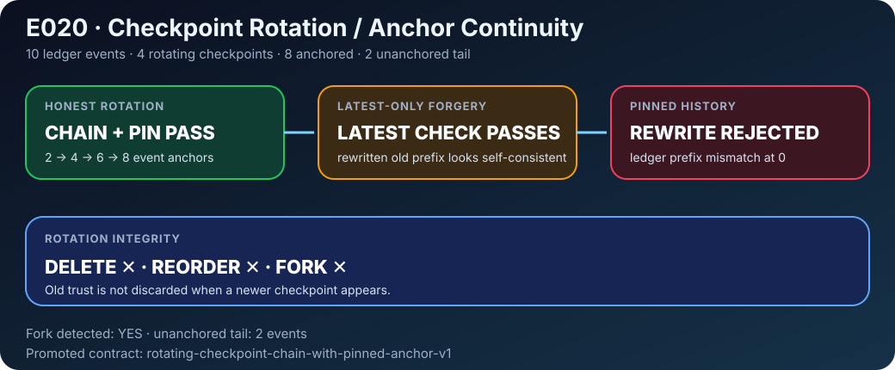

| Case | Result |
| --- | --- |
| Honest rotation | **PASS** |
| Pinned checkpoint continuity | **PASS** |
| Delete checkpoint | **REJECTED** |
| Reorder checkpoints | **REJECTED** |
| Latest-only forged checkpoint | **ACCEPTED by weak verifier** |
| Same rewrite with pinned history | **REJECTED** |
| Checkpoint fork | **DETECTED** |

- Anchored ledger prefix: **8/10 events**
- Unanchored tail: **2 events**
- Latest-only weakness: **ok**
- Pinned rotation result: **ledger prefix mismatch at 0**
- Promoted rotation contract: **rotating-checkpoint-chain-with-pinned-anchor-v1**

## E021 — multi-witness checkpoint quorum

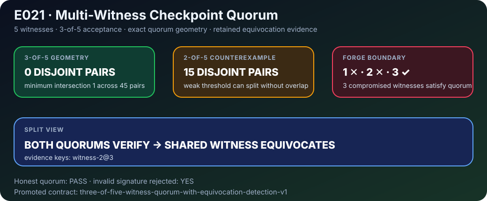

| Geometry / attack | Result |
| --- | --- |
| 3-of-5 quorum pairs | **45 pairs / 0 disjoint** |
| 3-of-5 minimum intersection | **1 witness** |
| 2-of-5 disjoint quorum pairs | **15** |
| 1 compromised witness | **forge rejected** |
| 2 compromised witnesses | **forge rejected** |
| 3 compromised witnesses | **forge threshold reached** |
| conflicting 3-of-5 views | **both verify, equivocation exposed** |

- Equivocation evidence: **witness-2@3**
- Invalid signature rejected: **YES**
- Promoted witness contract: **three-of-five-witness-quorum-with-equivocation-detection-v1**

## E022 — correlated witness failure domains

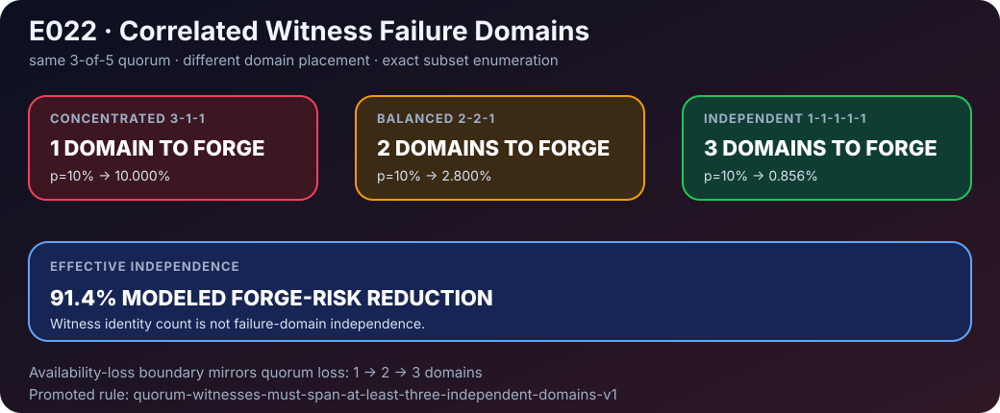

| Topology | Min domains to forge | Forge probability @ 10% domain event |
| --- | ---: | ---: |
| concentrated 3-1-1 | **1** | **10.000%** |
| balanced 2-2-1 | **2** | **2.800%** |
| independent 1-1-1-1-1 | **3** | **0.856%** |

- Modeled forge-risk reduction, independent vs concentrated: **91.4%**
- Availability-loss domain boundary: **1 → 2 → 3**
- Promoted failure-domain rule: **quorum-witnesses-must-span-at-least-three-independent-domains-v1**

## E023 — hidden common-mode dependency adversary

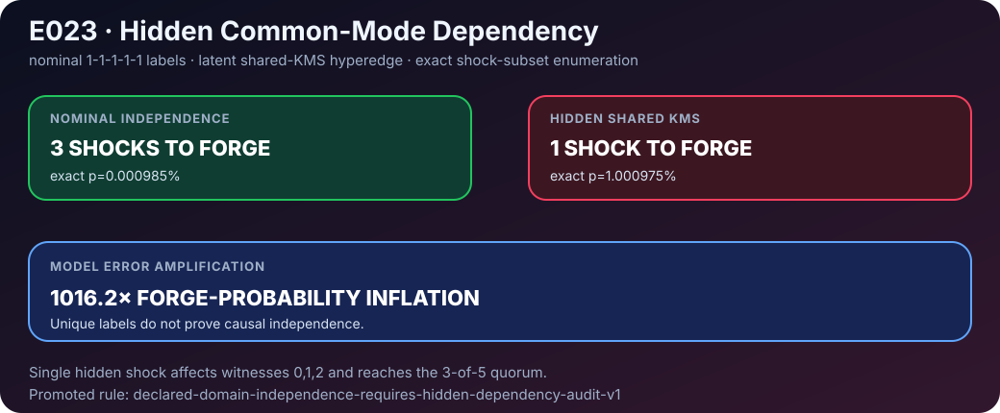

| Model | Min shocks to forge | Exact forge probability |
| --- | ---: | ---: |
| nominal independent | **3** | **0.000985%** |
| + hidden shared-KMS | **1** | **1.000975%** |

- Forge-probability inflation: **1016.2×**
- Hidden single shock reaches witnesses **0,1,2**
- Promoted dependency rule: **declared-domain-independence-requires-hidden-dependency-audit-v1**

These are model-relative synthetic results. They are not real-market recommendations.
